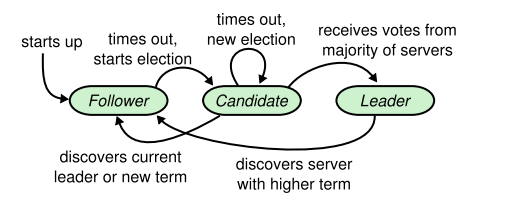

# raft 需求
**raft status flow**


## 1. 基础RPC
- [x] 发送信息，并且回复成功  
- [x] 超时异常报错  
- [x] 连接失败异常报错  
- [x] 序列化与反序列化  
- [ ] 服务路由  
- [x] 部分配置需要从config 里面去获取，因为配置会更新不能取出来

## 2. 机器角色
- [x] salve
  - [x] Respond to RPCs from candidates and leader
  - [ ]If electionRaft timeout elapses without receiving AppendEntries  RPC from current leader or granting vote to candidate: convert to candidate
- [x] leader 
  - [ ] Upon electionRaft: send initial empty AppendEntries RPCs  (heartbeat) to each server; repeat during idle periods to prevent electionRaft timeouts, and maintain metadata of the all followers;
  - [ ] If command received from client: append entry to local log, respond after entry applied to state machine
  - [ ] If last log index ≥ nextIndex for a follower: send AppendEntries RPC with log entries starting at nextIndex
    - [ ] If successful: update nextIndex and matchIndex for follower
    - [ ] If AppendEntries fails because of log inconsistency: decrement nextIndex and retry
  - [ ] If there exists an N such that N > commitIndex, a majority of matchIndex[i] ≥ N, and log[N].term == currentTerm: set commitIndex = N
## 2. append log
- [x] master send data
- [x] slave receive data
- [ ] If RPC request or response contains term T > currentTerm: set currentTerm = T, convert to follower (§5.1)
- [ ] 日志状态追加，如果加入到一个新的集群或者日志同步过程中落后了，需要请求master或者告知master同步日志状态到master的状态
  - [ ] 处理在同步的时候同时还会存在日志不断追加的过程，这个过程怎么进行管理

## 3. 心跳检测/健康机制
- [x] 正常请求与回复
- [x] 健康检查，健康判断
- [x] 超时判断，判断为异常
- [ ] master 重启恢复
- [ ] follower 重启恢复

## 4. 选举
- [x] 将当前机器从 follower 状态配置为 candidate
- [x] 发送消息给所有的 candidate   
    - [x] epoch 任期号+选举号  
    - [x] 随机 pause
- [x] 接受来自其他 candidate 的消息，并且比较epoch 来判断是否接受 propose
- [x] 选举出新的leader之后，leader同步全局状态。
- [ ] On conversion to candidate, start electionRaft:   
    - [x] Increment currentTerm   
    - [x] Vote for self   
    - [ ] Reset electionRaft timer   
    - [ ] Send RequestVote RPCs to all others server   
- [x] If votes received from the majority of servers: become leader/master
- [ ] If AppendEntries RPC received from new leader: convert to follower
- [ ] 在途中加入cluster
- [ ] If electionRaft timeout elapses: start new electionRaft

## 5. 配置更新（更新集群总数量）
- [ ] 增加/减少集群机器的总数量
- [ ] 配置文件化
- [ ] 多进程工具

# shell 启动命令
启动三个server 
```shell
 java -Dconfig.file=C:\Users\oo\Desktop\code\java\mit-6.824\raft\src\main\resources\server1.properties -Dlog.dir=server1 -cp C:\Users\oo\Desktop\code\java\mit-6.824\raft\build\classes\java\test;C:\Users\oo\Desktop\code\java\mit-6.824\raft\build\resources\test;C:\Users\oo\Desktop\code\java\mit-6.824\raft\build\classes\java\main;C:\Users\oo\Desktop\code\java\mit-6.824\raft\build\resources\main;C:\Users\oo\Desktop\code\java\mit-6.824\build\libs\mit-6.824-1.0-SNAPSHOT.jar;C:\Users\oo\.gradle\caches\modules-2\files-2.1\org.jctools\jctools-core\4.0.1\e12d5984d45aee3976249400dae1bbcafcf5ff0a\jctools-core-4.0.1.jar;C:\Users\oo\.gradle\caches\modules-2\files-2.1\ch.qos.logback\logback-classic\1.4.5\28e7dc0b208d6c3f15beefd73976e064b4ecfa9b\logback-classic-1.4.5.jar;C:\Users\oo\.gradle\caches\modules-2\files-2.1\org.slf4j\slf4j-api\2.0.5\3a759df277e854f7c4ca951e5899bcec0dbdca73\slf4j-api-2.0.5.jar;C:\Users\oo\.gradle\caches\modules-2\files-2.1\ch.qos.logback\logback-core\1.4.5\e9bb2ea70f84401314da4300343b0a246c8954da\logback-core-1.4.5.jar;C:\Users\oo\.gradle\caches\modules-2\files-2.1\com.fasterxml.jackson.core\jackson-annotations\2.16.2\dfcd11c847ea7276aa073c25f5fe8ee361748d7f\jackson-annotations-2.16.2.jar;C:\Users\oo\.gradle\caches\modules-2\files-2.1\com.fasterxml.jackson.core\jackson-core\2.16.2\b4f588bf070f77b604c645a7d60b71eae2e6ea09\jackson-core-2.16.2.jar;C:\Users\oo\.gradle\caches\modules-2\files-2.1\com.fasterxml.jackson.datatype\jackson-datatype-jsr310\2.16.2\58e86108e4b1b1e893e7a69b1bbca880acfca143\jackson-datatype-jsr310-2.16.2.jar;C:\Users\oo\.gradle\caches\modules-2\files-2.1\com.fasterxml.jackson.core\jackson-databind\2.16.2\7fda67535b54d74eebf6157682b835c847410932\jackson-databind-2.16.2.jar;C:\Users\oo\.gradle\caches\modules-2\files-2.1\org.mockito\mockito-all\1.10.19\539df70269cc254a58cccc5d8e43286b4a73bf30\mockito-all-1.10.19.jar;C:\Users\oo\.gradle\caches\modules-2\files-2.1\org.junit.jupiter\junit-jupiter\5.9.1\9274d3757e224bc02eae367bd481062a263c150b\junit-jupiter-5.9.1.jar;C:\Users\oo\.gradle\caches\modules-2\files-2.1\org.junit.jupiter\junit-jupiter-engine\5.9.1\1bf771097bde296c3ab174861954e8aafaaf2e94\junit-jupiter-engine-5.9.1.jar;C:\Users\oo\.gradle\caches\modules-2\files-2.1\org.junit.platform\junit-platform-engine\1.9.1\83591e5089d6cea5f324aa3ecca9b19d5a275803\junit-platform-engine-1.9.1.jar;C:\Users\oo\.gradle\caches\modules-2\files-2.1\org.junit.platform\junit-platform-commons\1.9.1\3145f821b5cd10abcdc5f925baa5fffa6f1b628f\junit-platform-commons-1.9.1.jar;C:\Users\oo\.gradle\caches\modules-2\files-2.1\org.junit.jupiter\junit-jupiter-params\5.9.1\ffcd1013edaeee112be11fcddeb38882d79238de\junit-jupiter-params-5.9.1.jar;C:\Users\oo\.gradle\caches\modules-2\files-2.1\org.junit.jupiter\junit-jupiter-api\5.9.1\7bb53fbc0173e9f6a9d21d58297af94b1f2f9ce1\junit-jupiter-api-5.9.1.jar;C:\Users\oo\.gradle\caches\modules-2\files-2.1\org.opentest4j\opentest4j\1.2.0\28c11eb91f9b6d8e200631d46e20a7f407f2a046\opentest4j-1.2.0.jar org.lee.boot.Bootstrap

 java -Dconfig.file=C:\Users\oo\Desktop\code\java\mit-6.824\raft\src\main\resources\server2.properties -Dlog.dir=server2 -cp C:\Users\oo\Desktop\code\java\mit-6.824\raft\build\classes\java\test;C:\Users\oo\Desktop\code\java\mit-6.824\raft\build\resources\test;C:\Users\oo\Desktop\code\java\mit-6.824\raft\build\classes\java\main;C:\Users\oo\Desktop\code\java\mit-6.824\raft\build\resources\main;C:\Users\oo\Desktop\code\java\mit-6.824\build\libs\mit-6.824-1.0-SNAPSHOT.jar;C:\Users\oo\.gradle\caches\modules-2\files-2.1\org.jctools\jctools-core\4.0.1\e12d5984d45aee3976249400dae1bbcafcf5ff0a\jctools-core-4.0.1.jar;C:\Users\oo\.gradle\caches\modules-2\files-2.1\ch.qos.logback\logback-classic\1.4.5\28e7dc0b208d6c3f15beefd73976e064b4ecfa9b\logback-classic-1.4.5.jar;C:\Users\oo\.gradle\caches\modules-2\files-2.1\org.slf4j\slf4j-api\2.0.5\3a759df277e854f7c4ca951e5899bcec0dbdca73\slf4j-api-2.0.5.jar;C:\Users\oo\.gradle\caches\modules-2\files-2.1\ch.qos.logback\logback-core\1.4.5\e9bb2ea70f84401314da4300343b0a246c8954da\logback-core-1.4.5.jar;C:\Users\oo\.gradle\caches\modules-2\files-2.1\com.fasterxml.jackson.core\jackson-annotations\2.16.2\dfcd11c847ea7276aa073c25f5fe8ee361748d7f\jackson-annotations-2.16.2.jar;C:\Users\oo\.gradle\caches\modules-2\files-2.1\com.fasterxml.jackson.core\jackson-core\2.16.2\b4f588bf070f77b604c645a7d60b71eae2e6ea09\jackson-core-2.16.2.jar;C:\Users\oo\.gradle\caches\modules-2\files-2.1\com.fasterxml.jackson.datatype\jackson-datatype-jsr310\2.16.2\58e86108e4b1b1e893e7a69b1bbca880acfca143\jackson-datatype-jsr310-2.16.2.jar;C:\Users\oo\.gradle\caches\modules-2\files-2.1\com.fasterxml.jackson.core\jackson-databind\2.16.2\7fda67535b54d74eebf6157682b835c847410932\jackson-databind-2.16.2.jar;C:\Users\oo\.gradle\caches\modules-2\files-2.1\org.mockito\mockito-all\1.10.19\539df70269cc254a58cccc5d8e43286b4a73bf30\mockito-all-1.10.19.jar;C:\Users\oo\.gradle\caches\modules-2\files-2.1\org.junit.jupiter\junit-jupiter\5.9.1\9274d3757e224bc02eae367bd481062a263c150b\junit-jupiter-5.9.1.jar;C:\Users\oo\.gradle\caches\modules-2\files-2.1\org.junit.jupiter\junit-jupiter-engine\5.9.1\1bf771097bde296c3ab174861954e8aafaaf2e94\junit-jupiter-engine-5.9.1.jar;C:\Users\oo\.gradle\caches\modules-2\files-2.1\org.junit.platform\junit-platform-engine\1.9.1\83591e5089d6cea5f324aa3ecca9b19d5a275803\junit-platform-engine-1.9.1.jar;C:\Users\oo\.gradle\caches\modules-2\files-2.1\org.junit.platform\junit-platform-commons\1.9.1\3145f821b5cd10abcdc5f925baa5fffa6f1b628f\junit-platform-commons-1.9.1.jar;C:\Users\oo\.gradle\caches\modules-2\files-2.1\org.junit.jupiter\junit-jupiter-params\5.9.1\ffcd1013edaeee112be11fcddeb38882d79238de\junit-jupiter-params-5.9.1.jar;C:\Users\oo\.gradle\caches\modules-2\files-2.1\org.junit.jupiter\junit-jupiter-api\5.9.1\7bb53fbc0173e9f6a9d21d58297af94b1f2f9ce1\junit-jupiter-api-5.9.1.jar;C:\Users\oo\.gradle\caches\modules-2\files-2.1\org.opentest4j\opentest4j\1.2.0\28c11eb91f9b6d8e200631d46e20a7f407f2a046\opentest4j-1.2.0.jar org.lee.boot.Bootstrap

 java -Dconfig.file=C:\Users\oo\Desktop\code\java\mit-6.824\raft\src\main\resources\server3.properties -Dlog.dir=server3 -cp C:\Users\oo\Desktop\code\java\mit-6.824\raft\build\classes\java\test;C:\Users\oo\Desktop\code\java\mit-6.824\raft\build\resources\test;C:\Users\oo\Desktop\code\java\mit-6.824\raft\build\classes\java\main;C:\Users\oo\Desktop\code\java\mit-6.824\raft\build\resources\main;C:\Users\oo\Desktop\code\java\mit-6.824\build\libs\mit-6.824-1.0-SNAPSHOT.jar;C:\Users\oo\.gradle\caches\modules-2\files-2.1\org.jctools\jctools-core\4.0.1\e12d5984d45aee3976249400dae1bbcafcf5ff0a\jctools-core-4.0.1.jar;C:\Users\oo\.gradle\caches\modules-2\files-2.1\ch.qos.logback\logback-classic\1.4.5\28e7dc0b208d6c3f15beefd73976e064b4ecfa9b\logback-classic-1.4.5.jar;C:\Users\oo\.gradle\caches\modules-2\files-2.1\org.slf4j\slf4j-api\2.0.5\3a759df277e854f7c4ca951e5899bcec0dbdca73\slf4j-api-2.0.5.jar;C:\Users\oo\.gradle\caches\modules-2\files-2.1\ch.qos.logback\logback-core\1.4.5\e9bb2ea70f84401314da4300343b0a246c8954da\logback-core-1.4.5.jar;C:\Users\oo\.gradle\caches\modules-2\files-2.1\com.fasterxml.jackson.core\jackson-annotations\2.16.2\dfcd11c847ea7276aa073c25f5fe8ee361748d7f\jackson-annotations-2.16.2.jar;C:\Users\oo\.gradle\caches\modules-2\files-2.1\com.fasterxml.jackson.core\jackson-core\2.16.2\b4f588bf070f77b604c645a7d60b71eae2e6ea09\jackson-core-2.16.2.jar;C:\Users\oo\.gradle\caches\modules-2\files-2.1\com.fasterxml.jackson.datatype\jackson-datatype-jsr310\2.16.2\58e86108e4b1b1e893e7a69b1bbca880acfca143\jackson-datatype-jsr310-2.16.2.jar;C:\Users\oo\.gradle\caches\modules-2\files-2.1\com.fasterxml.jackson.core\jackson-databind\2.16.2\7fda67535b54d74eebf6157682b835c847410932\jackson-databind-2.16.2.jar;C:\Users\oo\.gradle\caches\modules-2\files-2.1\org.mockito\mockito-all\1.10.19\539df70269cc254a58cccc5d8e43286b4a73bf30\mockito-all-1.10.19.jar;C:\Users\oo\.gradle\caches\modules-2\files-2.1\org.junit.jupiter\junit-jupiter\5.9.1\9274d3757e224bc02eae367bd481062a263c150b\junit-jupiter-5.9.1.jar;C:\Users\oo\.gradle\caches\modules-2\files-2.1\org.junit.jupiter\junit-jupiter-engine\5.9.1\1bf771097bde296c3ab174861954e8aafaaf2e94\junit-jupiter-engine-5.9.1.jar;C:\Users\oo\.gradle\caches\modules-2\files-2.1\org.junit.platform\junit-platform-engine\1.9.1\83591e5089d6cea5f324aa3ecca9b19d5a275803\junit-platform-engine-1.9.1.jar;C:\Users\oo\.gradle\caches\modules-2\files-2.1\org.junit.platform\junit-platform-commons\1.9.1\3145f821b5cd10abcdc5f925baa5fffa6f1b628f\junit-platform-commons-1.9.1.jar;C:\Users\oo\.gradle\caches\modules-2\files-2.1\org.junit.jupiter\junit-jupiter-params\5.9.1\ffcd1013edaeee112be11fcddeb38882d79238de\junit-jupiter-params-5.9.1.jar;C:\Users\oo\.gradle\caches\modules-2\files-2.1\org.junit.jupiter\junit-jupiter-api\5.9.1\7bb53fbc0173e9f6a9d21d58297af94b1f2f9ce1\junit-jupiter-api-5.9.1.jar;C:\Users\oo\.gradle\caches\modules-2\files-2.1\org.opentest4j\opentest4j\1.2.0\28c11eb91f9b6d8e200631d46e20a7f407f2a046\opentest4j-1.2.0.jar org.lee.boot.Bootstrap
```
如下serverx.properties配置内容如下
```properties
currentPort=81
currentHost=localhost
pingSeg=1000
retryTimes=2
servers=localhost:81;localhost:82;localhost:83
```
